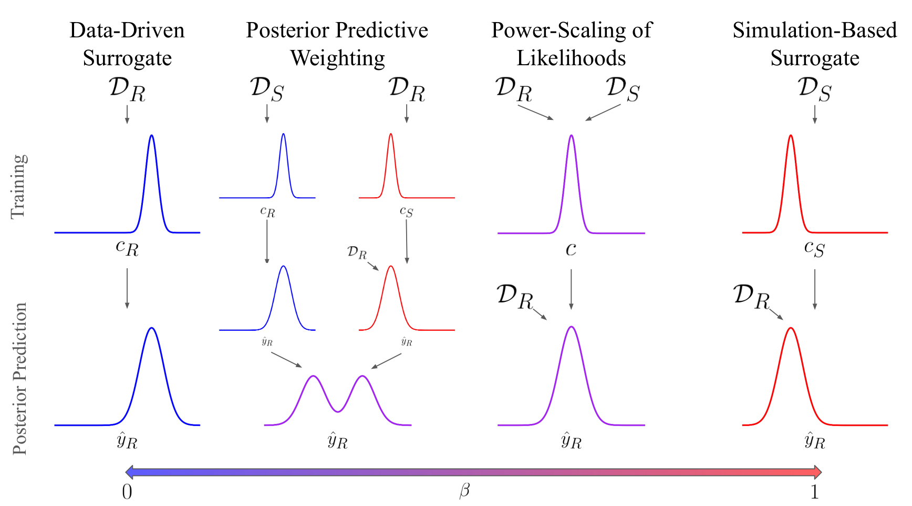

# Bayesian Surrogate Training on Multiple Data Sources: A Hybrid Modeling Strategy

__Authors:__ Philipp Reiser, Paul-Christian Bürkner, Anneli Guthke

------------------------------------------------------------------------

## Overview

This repository contains code to replicate key experiments from our
[paper](https://arxiv.org/abs/2412.11875) Bayesian Surrogate Training on Multiple Data Sources: A Hybrid Modeling Strategy.



------------------------------------------------------------------------


## Replicating

In this section, we will detail how to run the weighted surrogate training approaches `Power-Scaling` and `Posterior Predictive Weighting`. 
We will showcase this on the three scenarios: a synthetic scenario, a SIR scenario with synthetic data and a SIR scenario with real data.

All surrogate models are fitted using the script

```
R/main.R
```
The results are then stored in `results/`.

To get the evaluation polts run:
```
R/eval.R
```

For each case study a config file exists, which can either be specfied through the command line, 
or can be set manually in the `load_config_args.R`.

### Case Study 1

To replicate case study 1, use the config

```
config/log_sin.yml
```

### Case Study 2

To replicate case study 2.1  with synthetic SIR data, use the config

``` 
config/sir_2d_link-identity_likelihood-lognormal.yml
```

To replicate case study 2.2 with COVID19 real-world data from the [COVID-19 Data Hub](https://github.com/covid19datahub/COVID19/), use the config

```
config/sir_covid19.yml
```

------------------------------------------------------------------------

## Related repositories
- [Bayesian-surrogate-uncertainty](https://github.com/philippreiser/bayesian-surrogate-uncertainty-paper)

- [Bayesian-sparse-PCE](https://github.com/paul-buerkner/Bayesian-sparse-PCE)

------------------------------------------------------------------------

## Citation

``` bibtex
@misc{reiser2024bayesiansurrogatetrainingmultiple,
      title={Bayesian Surrogate Training on Multiple Data Sources: A Hybrid Modeling Strategy}, 
      author={Philipp Reiser and Paul-Christian Bürkner and Anneli Guthke},
      year={2024},
      eprint={2412.11875},
      archivePrefix={arXiv},
      primaryClass={stat.ML},
      url={https://arxiv.org/abs/2412.11875}, 
}
```

